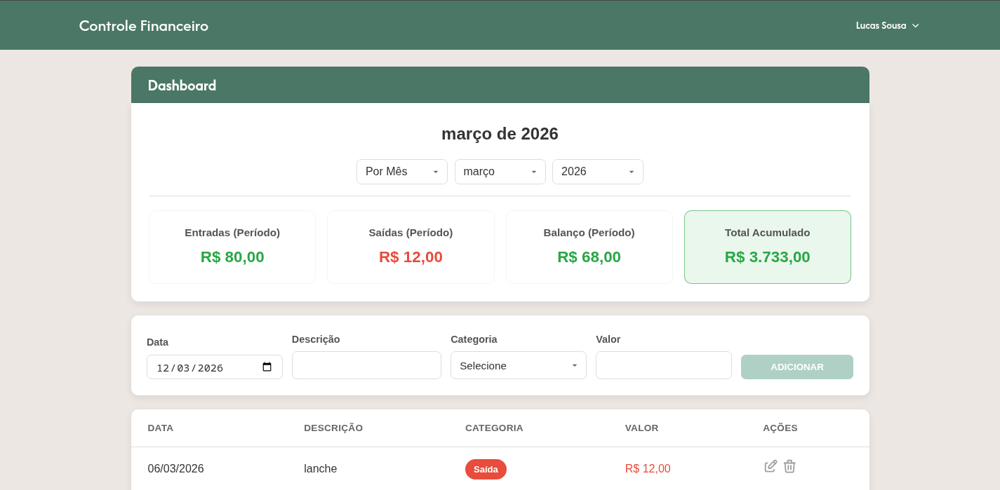

# Controle Financeiro




Aplicacao web para controle financeiro pessoal com autenticacao via Supabase e um dashboard de transacoes. Construido com Next.js (App Router), React e TypeScript.

## Funcionalidades

- Autenticacao com e-mail/senha e Google OAuth.
- Recuperacao de senha por e-mail.
- Dashboard com filtros por mes/ano.
- Resumo financeiro do periodo (entradas, saidas, balanco e total acumulado).
- Cadastro, edicao e exclusao de transacoes (entrada/saida).
- Dados isolados por usuario com politicas RLS no Supabase.

## Stack

- Next.js 16 (App Router)
- React 19
- TypeScript
- Supabase (Auth + Postgres)
- Sass Modules
- React Icons

## Requisitos

- Node.js LTS
- Conta no Supabase

## Configuracao local

1. Instale as dependencias:

```bash
npm install
```

2. Crie o arquivo `.env.local` a partir de `.env.example`:

```env
NEXT_PUBLIC_SUPABASE_URL=https://YOUR_PROJECT_REF.supabase.co
NEXT_PUBLIC_SUPABASE_ANON_KEY=YOUR_SUPABASE_ANON_KEY
```

3. No Supabase, execute o SQL em `supabase/schema.sql` para criar a tabela `transactions` e as politicas RLS.

4. Rode o projeto:

```bash
npm run dev
```

A aplicacao estara em `http://localhost:3000`.

## Configurar Google OAuth

Para habilitar login com Google:

1. Supabase > Authentication > Providers > Google.
2. Ative o provider e informe `Client ID` e `Client Secret`.
3. No Google Cloud, adicione a URL de callback:

```text
https://<SEU_PROJECT_REF>.supabase.co/auth/v1/callback
```

4. Em Supabase > Authentication > URL Configuration, adicione os redirects do app:

```text
http://localhost:3000/
http://localhost:3000/reset-password
https://seu-dominio.com/
https://seu-dominio.com/reset-password
```

## Scripts

- `npm run dev`: ambiente de desenvolvimento
- `npm run build`: build de producao
- `npm run start`: iniciar build de producao
- `npm run lint`: lint do projeto

## Estrutura de pastas

- `src/app`: rotas (home, termos, privacidade, reset de senha)
- `src/features`: features de autenticacao e dashboard
- `src/components`: layout e secoes compartilhadas
- `src/lib`: integracao com Supabase
- `supabase/schema.sql`: schema e politicas RLS
